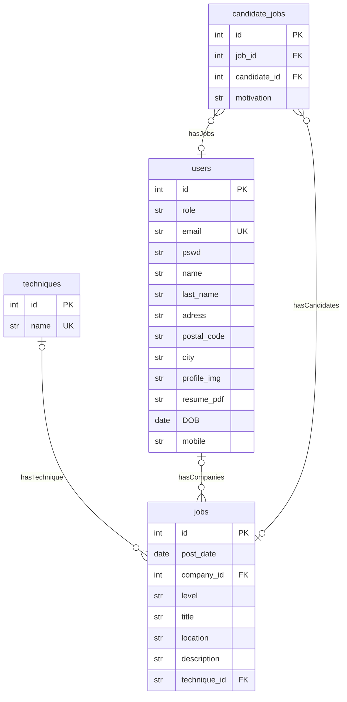

```mermaid
erDiagram
    jobs {
        int id PK
        date post_date
        int company_id FK
        str level
        str title
        str location
        str description
        str technique_id FK
    }

    techniques o|--o{ jobs: hasTechnique
    techniques {
        int id PK
        str name UK
    }

    users o|--}o jobs: hasCompanies
    users {
        int id PK
        str role
        str email UK
        str pswd
        str name
        str last_name
        str adress
        str postal_code
        str city
        str profile_img
        str resume_pdf
        date DOB
        str mobile
    }
    %% candidates and companies are both in the users table
    %% the name is the name of the company or the first name of the candidate
    %% the profile_img is the logo of the company or the cover img of the candidate
    %% last_name, resume_pdf, DOB and mobile are NULL when the user is a company
    %% only role, email, pswd, name and profile_img are filled in for the admin user, all else NULL

    candidate_jobs o{--|o jobs: hasCandidates
    candidate_jobs o{--|o users: hasJobs
    candidate_jobs {
        int id PK
        int job_id FK
        int candidate_id FK 
        str motivation
    }
```
